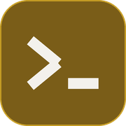
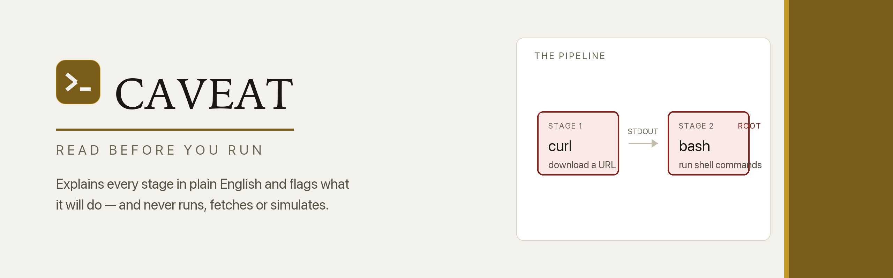
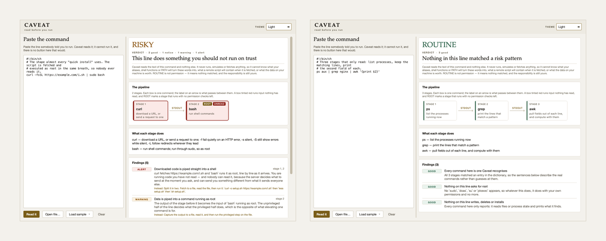

<div align="center">



<picture>
  <source media="(prefers-color-scheme: dark)" srcset="images/banner-dark.png">
  
</picture>

<br>

**An offline reader for shell commands: it explains what a line will do, stage
by stage, and never claims that any line is safe to run.**

<br>


</div>

---

## Why

A shell one-liner is a flow chart that somebody flattened into a single line of
text, and the flattening is most of why people run things they did not mean to.

```bash
curl -fsSL https://example.com/install.sh | sudo bash
```

That reads as one gesture. It is two programs joined by a pipe, and the second
one executes, as root, text that arrived from a server a quarter of a second
ago and that nobody has read — not you, and not the person who sent it to you,
because the server chooses what to send at the moment you ask.

Caveat unflattens it. Paste the line and it draws the pipeline as boxes, writes
a plain sentence for every stage — not `-rf`, but *recurse into directories and
never prompt* — and names what the line will do to your machine, each finding
with a safer way to get the same job done.

<div align="center">
<picture>
  <source media="(prefers-color-scheme: dark)" srcset="images/screens-dark.png">
  
</picture>
<br>
<sub>The install-script shape read as RISKY, its second box marked ROOT and UNREAD — beside <code>ps | grep | awk</code>, three boxes, read as ROUTINE.</sub>
</div>

## The honest part

Caveat reads the **text** of a command and nothing else. It never runs,
simulates or fetches anything, so it cannot know what your aliases, shell
functions or `PATH` will turn these words into, or what a remote script will
contain when it is fetched. Nor can it know what the files on your
machine are worth to you — the only question that really decides whether a
command is dangerous, and the one question a program cannot answer.

So the verdict is four words, and the top one is deliberately modest.

| | |
|---|---|
| **ROUTINE** | Nothing matched. Every command was recognised, and the line parsed cleanly. |
| **WORTH A LOOK** | A real hazard — or a gap in what Caveat could read. |
| **RISKY** | Code nobody has read is run, a way in is opened, or root takes its orders from somewhere else. |
| **DESTRUCTIVE** | Something here removes data that does not come back. |

**ROUTINE is not permission.** It means nothing in the register matched — not
that the line is safe, not that it does what its sender says it does. The word
*safe* appears nowhere in a result, by design.

**Unknown beats a guess.** A single command Caveat has never heard of caps the
line at WORTH A LOOK, because "nothing matched" would otherwise mean "nothing
was looked at", and the headline names the word that capped it. Quoting that
never closes and a command word built from a variable cap it the same way. The
rule runs all the way down to the flags: `-n` is a line count to `head` and a
dry run to `rsync`, so a flag is explained only where its meaning is known for
*that* command. A wrong gloss is worse than no gloss.

**Shapes, not names.** Every detection is a property of the text — a fetcher
piped into something that executes what it is given, a delete target that is a
variable with a slash glued on. There is no list of bad domains or forbidden
tools, because such a list is out of date the day it ships and it teaches
nothing.

## Install

```bash
git clone https://github.com/at0m-b0mb/Caveat-Shell-Reader.git
cd Caveat-Shell-Reader
python3 -m pip install -r requirements.txt   # just PyQt6, for the window
```

The engine and the command line need no dependencies at all — only the standard
library. PyQt6 is there for the window and nothing else.

## Use

**The window:**

```bash
python3 -m caveat          # or:  python3 run.py
```

Paste a command, open a script, or load one of the seven samples. Light, Dark
and Auto are in the top right.

**The command line** — the same engine, no Qt, pipe-friendly:

```bash
python3 -m caveat samples/install-script.sh          # a readable report
python3 -m caveat -e 'rm -rf $DIR/'                  # read a line directly
echo 'curl -sL https://x/f.tgz -o f.tgz' | python3 -m caveat -
python3 -m caveat samples/install-script.sh --json   # machine-readable
```

```
  RISKY   This line does something you should not run on trust

The pipeline
  1. curl
     download a URL, or send a request to one
    │  stdout
  2. bash  [ROOT · RUNS UNREAD INPUT]
     run shell commands

What each stage does
  curl — download a URL, or send a request to one; -f fail quietly on an HTTP error, …
  bash — run shell commands; run through sudo, so as root

Findings (5: 2 good, 1 notice, 1 warning, 1 alert)
  [ alert ] Downloaded code is piped straight into a shell  stage 1,2
          curl fetches https://example.com/i.sh and `bash` runs it as root, line by
          line as it arrives. You are running code you have not read — and nobody
          can read it, because the server decides what to send at the moment you
          ask, and can send you something different from what it sends everyone
          else.
          Instead: Split it in two. Fetch to a file, read the file, then run it:
          `curl -o setup.sh https://example.com/i.sh` then `less setup.sh` then `sh
          setup.sh`.
```

Exit status is `0` for a reading and `2` when there was nothing to read. The
verdict never reaches the exit code, because a script branching on it would be
making exactly the judgement Caveat refuses to make for you.

## What it checks

Twenty-seven rules, each one a shape rather than a name. Caveat reads into the
line as well as across it: a `$( … )` substitution, a `<( … )` process
substitution and a `-c` script handed to a shell are command lines in their own
right, so they become stages too, down three levels, with every finding
attributed back to the box on the diagram you can actually point at.

| Family | What trips it |
|---|---|
| **Running unread code** | a fetcher piped into a shell; `bash <(curl …)`; `eval "$(curl …)"`; text decoded from base64 or hex and then run |
| **Deleting** | `rm -rf` aimed at `/`, `~`, `$HOME`, a system directory, a glob, or a variable with a path glued on — the last becomes `rm -rf /` the moment the variable is empty |
| **Disks** | `dd of=/dev/…`, `mkfs`, `wipefs -a`, a redirect onto a block device, `shred` on a device |
| **The fork bomb** | a function that calls itself twice and backgrounds both |
| **Permissions** | `chmod 777`, the setuid bit, a recursive `chmod` across a system path, `chown -R` outside a home directory, `setenforce 0` |
| **Privilege** | every stage that runs as root, named; a pipe *into* `sudo`; `sudo -S` taking a password from the pipe |
| **Transport** | `curl -k`, `--no-check-certificate`, `http.sslVerify=false`, `--trusted-host`; plain `http://`, worse when what arrives is executed |
| **Trust** | `StrictHostKeyChecking=no`, `UserKnownHostsFile=/dev/null`, agent forwarding |
| **Backdoors** | `nc -e`, `bash -i >& /dev/tcp/…`, `socat … exec:`, an inline program that opens a socket and duplicates it onto the standard streams |
| **The record** | `history -c`, `unset HISTFILE`, a log deleted or truncated, `journalctl --vacuum-*` |
| **Persistence** | a crontab installed or removed, `at`, `systemd-run`, `systemctl enable`, a trailing `&` |
| **Defences off** | `ufw disable`, `iptables -F`, a default policy of ACCEPT, `nft flush ruleset` |
| **Containers** | `--privileged`, the host root or the Docker socket mounted in, host networking |
| **Supply chain** | a package installed from a URL or a replacement index, npm install scripts, global installs |
| **Quoting** | an unquoted `$VAR` used as a path, an unquoted `$@` |
| **The unknown** | a command with no dictionary entry, a command word built from a variable, a program named by path, quoting that never closes, a program written inline in another language |

Findings are sorted most serious first, and every one above a notice carries an
alternative — a warning with no way out only teaches people to click past
warnings.

## Privacy

Caveat never touches the network. It opens no sockets, resolves no names and
sends nothing anywhere; the whole reading is the standard library looking at
text you already have. A command you paste in stays on your machine, which
matters, because the lines people most want explained are the ones they should
least be forwarding to a web service.

## Tests

```bash
python3 -m pip install -r requirements-dev.txt
python3 -m pytest -q
```

1103 tests. Every rule has two: a line that must trip it, and a line that looks
like it but must not — the second being the one that keeps the tool usable.
The dictionary is held to a table of correct glosses and a table of meanings it
must never produce. The diagram's wrapping is exercised at every width through
a stand-in text measurer, so it can be tested without a screen. And the
contrast suite holds every text colour to WCAG AA against its background, in
both themes.

## Layout

```
caveat/
  core/            the engine — pure standard library, no Qt
    model.py         the dataclasses everything speaks in
    lexer.py         text  ->  chunks  ->  stages, tolerantly
    explain.py       the dictionary: 187 commands and the flags that bite
    rules.py         27 detections, each with a safer alternative
    assess.py        the verdict, and the ceiling over it
  ui/              the window
    theme.py         the design system: one place for every token
    pipeline.py      the pipeline diagram — Caveat's signature element
    widgets.py       cards, chips, key/value rows
    main_window.py   the reader itself
  cli.py           the same engine on the command line
  app.py           the Qt bootstrap: make the app, open the window
  __main__.py      the window, or the CLI if given an argument
samples/           seven lines, ROUTINE through DESTRUCTIVE
tests/             1103 tests, including the contrast suite
tools/             off-screen screenshot capture and the repository art
images/            marks, banners, screenshots, social card
run.py             opens the window
```

## Colophon

Set in **Iowan Old Style** for identity, the system **sans** for anything you
read, and a **mono** for the commands themselves — because a command *is* code,
and setting it in body text is the first small lie a tool like this could tell.
The palette is warm paper and two golds: a deep brass legible as small text,
and a brighter shine kept for marks that carry no words. Dark mode is true
black, with nothing in the ramp that reads as blue. Every colour is declared as
a light/dark pair, and the contrast suite holds every pairing to WCAG AA so the
theme cannot quietly regress.

## License

MIT — see [LICENSE](LICENSE). For authorised, educational and personal use:
Caveat is a reader, not a runner.
